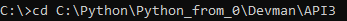
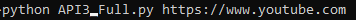
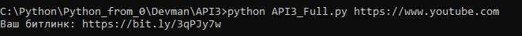
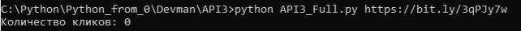
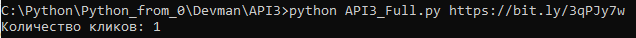

# API3_Bitlink
Программа является копией предыдущей программы [API2](https://github.com/BAIBASH1/API2_Bitlink), только добавлена возможность передавать ссылку прямо в командной строке сделана для сокращения ссылок и подсчета кликов за все время.

## Работа программы ##
1. В командной строке (у меня Windows) находим директорию кода 
 
2. передаем команду в следующем формате:

\
т.е. сначала ```python API3_Full.py``` далее ссылку ```https://www.youtube.com```
---

  1. Если получает длинную, то возвращает укороченную ссылку. \
  
  

  3. Если получает укороченную, то возвращает количество кликов по ней за все время.\
  
  

Ссылки укорачиваются при помощи сайта [bitly.com](https://app.bitly.com/bbt2/)

----
## Запуск: ##
  * Для запуска программы скачайте код с GitHub. Установите библиотеки:
  
    ```pip install -r requirments.txt```
  
  * Для кода необходим токен вашего аккаунта на битлинк, [ссылка](https://dev.bitly.com/) на то, как его получать.
  * По соседству с кодом создайте файл ".env", с текстом внутри:
  
     ```BITLY_TOKEN=```\
     \
     и введите полученный токен из предыдущего пункта.
  
  * После этого программа готова к работе.
### Проверка ###
1. Введите на вход любую длинную ссылку, на выходе должна получиться укороченная ссылка:\
\
  

2. Скопируйте полученную ссылку, и введите ее, заново запустив программу.\
Программа должна вывести количество кликов по данной ссылке(в вашем случает количество кликов=0)\
\
  

3. Попробуйте перейти по укороченной ссылке, и повторить 2-ой шаг. Количество кликов должно увеличиться.\
\


4. Если все пункты работают, то программа готова к эксплуатации.
